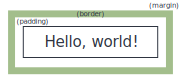

# empposter: A simple LaTeX template for scientific posters

LaTeX is certainly not the easiest way to develop an academic poster, and
an argument can be made that it's not actually the best way. However, poster
printers and graphic design departments typically expect posters in PDF for
traditional paper or fabric printing.

If you're committed to the LaTeX route, you need a starting point, and this
repo may be helpful. (This class is similar to, but not exactly like, the
[baposter](http://www.brian-amberg.de/uni/poster) class, and your aesthetic
preferences may be more in line with baposter. It's a great package with a
long history.)

See the simple demonstration of _empposter_ in the [demo](./demo) directory.

## Box layout

The inspiration for the layout of boxes in _empposter_ is largely inspired
by HTML. Each `posterbox` is comprised of multiple nexted LaTeX boxes:

  1. A margin box, which defines empty space around the next box,
  2. A border box, which sets a color and width for the border around the next box,
  3. A padding box, which sets additional empty space inside the border and around the content
  4. A content box, which contains the desired text, images, etc.

The image below shows the hierarchy of these boxes. A difference from HTML is
that, for _empposter_, the width parameter given as a keyword specifies the
**full** width of the box, including its margins and border. This makes
element positioning for print media easier.

<!-- vim: set ft=markdown: -->
